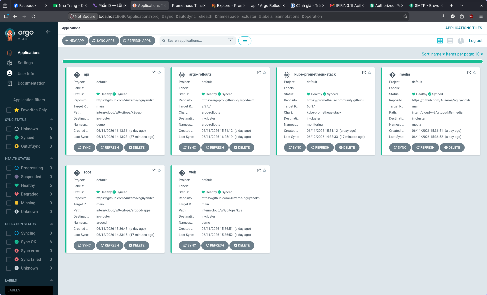
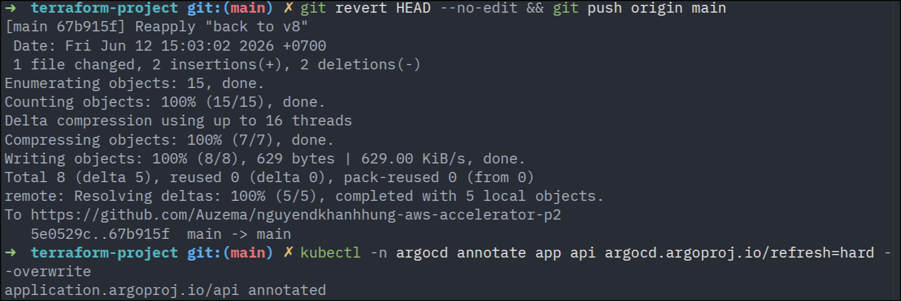
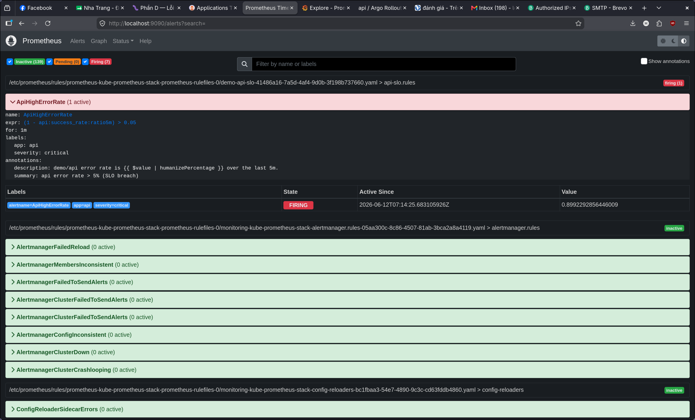
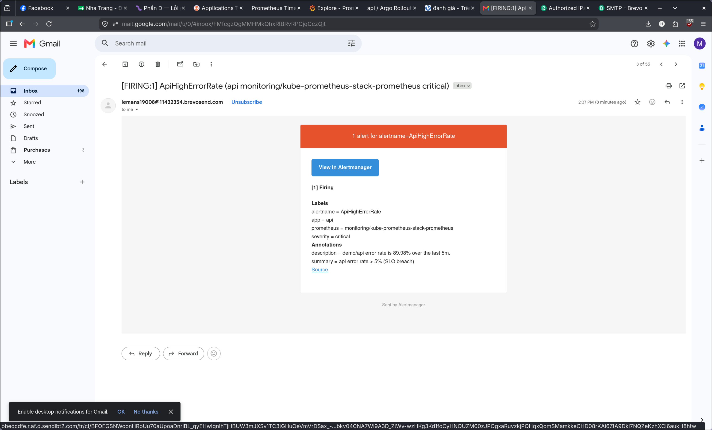
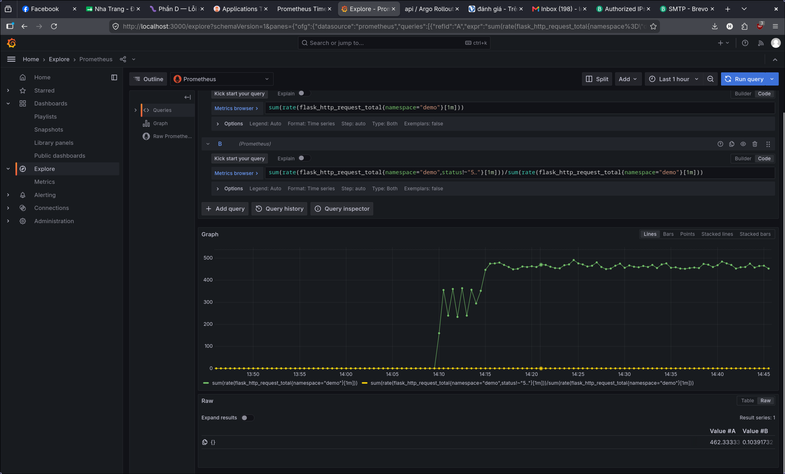
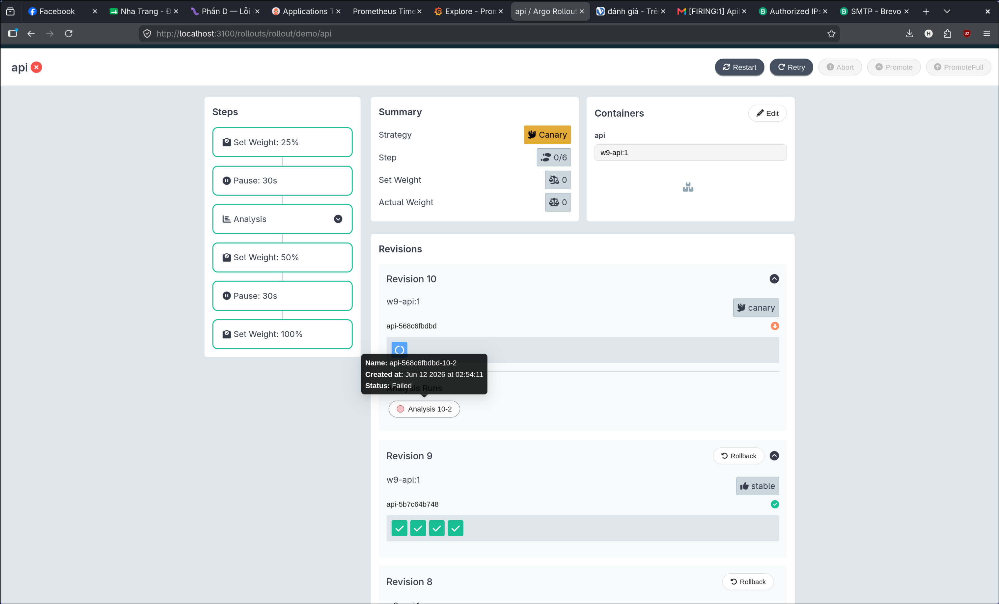

# W9 Challenge — "Ship Smartly"

Pipeline ship an toàn: đổi version **qua Git** → ArgoCD tự sync → **canary** thả dần →
**metric/SLO** tự chấm → tốt thì lên 100%, lỗi thì **tự abort** về bản cũ; có **alert + email**
khi chất lượng tụt.

- **Cụm:** minikube `w9` · **GitOps:** ArgoCD (app-of-apps) · **Observability:** Prometheus + Grafana + Alertmanager · **Canary:** Argo Rollouts.
- **App demo:** `api` (Flask, có `/metrics` + biến `ERROR_RATE` để inject lỗi).

---

## 1. Kết quả — 4/4 tiêu chí ĐẠT

| # | Tiêu chí | Bằng chứng |
|---|----------|-----------|
| 1 | Thay đổi qua Git · ArgoCD Synced (no drift) · reproduce từ Git | `ArgoCDSynced.png` |
| 2 | `git revert` rollback < 5 phút | `GitRevertRollback.png` |
| 3 | 1 SLO + 1 alert fire về email khi inject lỗi | `ApiHighErrorRate.png` · `AlertMail.png` · `GrafanyGraph.png` |
| 4 | Canary bản lỗi **tự abort** về bản cũ (quan trọng nhất) | `CanaryAutoAbort.png` |

---

## 2. Cấu trúc repo (mọi thứ qua Git)

```
intern/cloud/w9/gitops/
├── argocd/
│   ├── root.yaml              app-of-apps: theo dõi apps/, tự tạo các Application con
│   └── apps/                  Application: web, media, api, kube-prometheus-stack, argo-rollouts
└── k8s-api/
    ├── rollout.yaml           Rollout (canary 25→50→100, có bước analysis)
    ├── service.yaml           Service + ServiceMonitor (Prometheus scrape /metrics)
    ├── analysistemplate.yaml  AnalysisTemplate: luật tự chấm canary
    └── prometheusrule.yaml    SLO recording rule + alert ApiHighErrorRate
```

`Rollout` + `AnalysisTemplate` + `SLO/alert` đều nằm trong Git → ArgoCD đồng bộ.

---

## 3. Tiêu chí 1 — GitOps, no drift, reproduce

6 Application đều **Synced + Healthy** (cụm khớp Git, không lệch). `root` quản 5 app con qua
folder `apps/`. Đập cụm → cài lại ArgoCD → `kubectl apply -f argocd/root.yaml` **1 lần** →
toàn bộ hệ thống tự dựng lại từ Git.



---

## 4. Tiêu chí 2 — Rollback bằng `git revert` < 5'

Trong GitOps, rollback cũng qua Git: `git revert` tạo commit đảo ngược → ArgoCD sync cụm về
trạng thái cũ. Khác `kubectl rollout undo` (bị self-heal ghi đè) — `git revert` đổi đúng
**nguồn sự thật** + có audit (ai revert, lúc nào).

```bash
git revert HEAD --no-edit && git push origin main
kubectl -n argocd annotate app api argocd.argoproj.io/refresh=hard --overwrite
```



---

## 5. Tiêu chí 3 — SLO + alert → email

### SLI / SLO (giải thích query & ngưỡng)

- **SLI** = tỉ lệ request thành công (không phải 5xx) / tổng request, cửa sổ trượt **5 phút**.
- **SLO mục tiêu** = success rate ≥ 99.5% (error budget 0.5%).
- **Alert** fire khi **error rate > 5%** liên tục **1 phút** (`for: 1m`).
  Ngưỡng 5% chọn để fire nhanh khi demo; production thật nên dùng **multi-window burn rate** (1h/5m + 6h/30m).

**Recording rule (SLI) — `prometheusrule.yaml`:**
```promql
api:success_rate:ratio5m =
  sum(rate(flask_http_request_total{namespace="demo", status!~"5.."}[5m]))
  /
  sum(rate(flask_http_request_total{namespace="demo"}[5m]))
```

**Alert — `ApiHighErrorRate`:**
```yaml
expr:  (1 - api:success_rate:ratio5m) > 0.05    # error rate > 5%
for:   1m
labels: { severity: critical }
annotations:
  summary:     "api error rate > 5% (SLO breach)"
  description: "demo/api error rate is {{ $value | humanizePercentage }} over the last 5m."
```

**Email:** Alertmanager → SMTP (Brevo relay) → email cá nhân. Mật khẩu SMTP để trong
Kubernetes Secret (`alertmanager-smtp`), **không commit lên Git**; manifest chỉ tham chiếu tên Secret.
Route: `severity = critical` → receiver `email`; `Watchdog` → bỏ.

### Bằng chứng

Prometheus báo alert **FIRING** (error ~89.9%, vượt ngưỡng 5%):


Email nhận được khi alert fire:


Đồ thị success rate **tụt** khi inject lỗi (xuống ~10%):


---

## 6. Tiêu chí 4 — Canary tự abort (quan trọng nhất)

`Rollout` thả canary theo bước: `setWeight 25 → pause → analysis → 50 → pause → 100`.
Ở bước `analysis`, `AnalysisTemplate` query Prometheus; nếu success rate tụt → **tự abort**, không cần người.

**AnalysisTemplate — `analysistemplate.yaml` (query & ngưỡng):**
```yaml
metrics:
  - name: success-rate
    interval: 20s
    count: 5                         # đo 5 lần trong bước canary
    successCondition: result[0] >= 0.95   # >= 95% non-5xx = khỏe
    failureLimit: 2                  # tệ 2 lần -> FAIL -> abort rollout
    provider:
      prometheus:
        address: http://kube-prometheus-stack-prometheus.monitoring.svc:9090
        query: |
          sum(rate(flask_http_request_total{namespace="demo", status!~"5.."}[1m]))
          /
          sum(rate(flask_http_request_total{namespace="demo"}[1m]))
```

- **Good run** (`ERROR_RATE=0`): success ~100% ≥ 95% → analysis PASS → canary tự lên 100%.
- **Bad run** (`ERROR_RATE=0.9`): success tụt < 95% → analysis FAIL → **Rollout tự abort** → giữ bản cũ stable. Chỉ ~25% traffic từng dính.

Bằng chứng — Analysis **Failed** (đỏ), revision lỗi scale về 0, bản cũ (Revision 9) vẫn **stable**:


---

## 7. Cách reproduce (tóm tắt)

```bash
minikube start -p w9 --cpus=4 --memory=6g
# cài ArgoCD, rồi:
kubectl apply -f gitops/argocd/root.yaml      # root tự dựng web + media + api + monitoring + rollouts
# tạo Secret SMTP (không commit):
kubectl -n monitoring create secret generic alertmanager-smtp --from-literal=password='<smtp-key>'
```

Inject lỗi để test: sửa `ERROR_RATE` trong `k8s-api/rollout.yaml` → push → quan sát canary + alert.

---

## 8. Hạn chế đã biết

- **AnalysisTemplate đo success rate toàn namespace**, không chỉ riêng pod canary. Khi rollback
  từ bản lỗi về bản tốt, các pod lỗi cũ còn lại kéo điểm xuống → analysis có thể abort nhầm bản tốt.
  Cách sửa đúng: thêm nhãn pod canary vào query để chỉ đo pod mới.
- **Alertmanager dùng Brevo relay** vì Gmail account chặn app password; production nên dùng SMTP
  relay có sender verified hoặc dịch vụ email chuyên dụng.
- Ngưỡng alert đơn cửa sổ (`> 5% for 1m`) cho demo; production nên multi-window burn rate.
